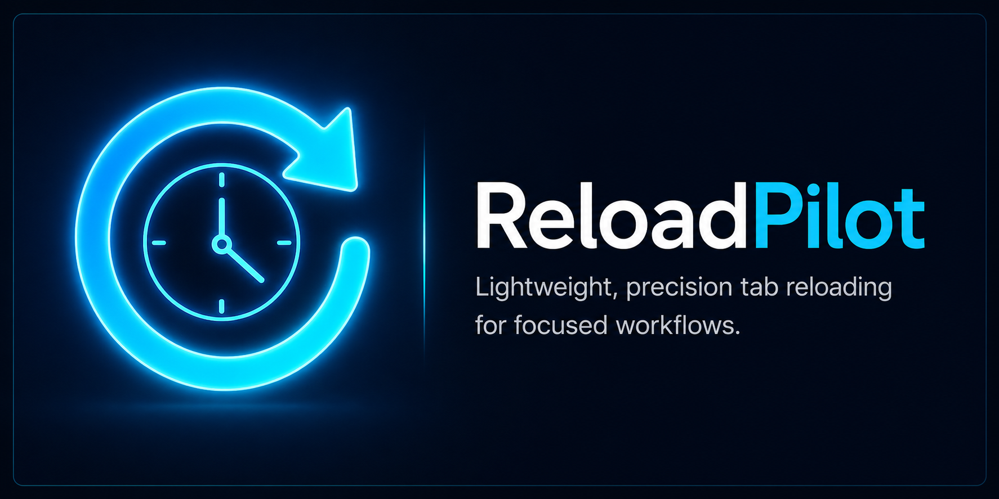
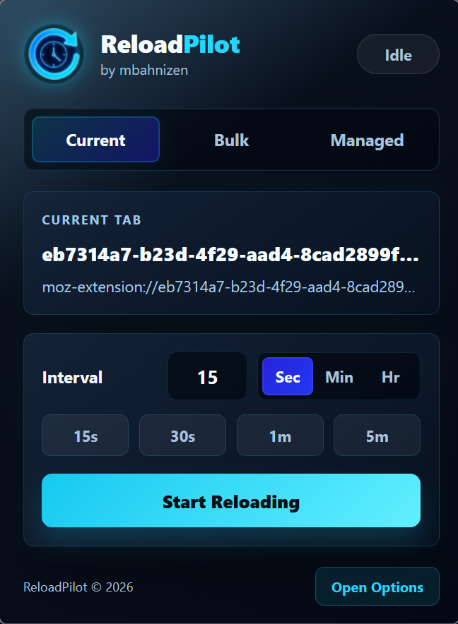
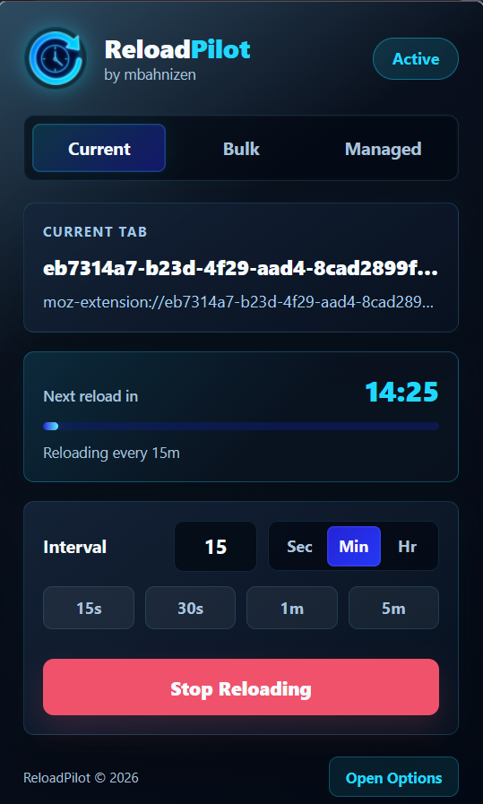
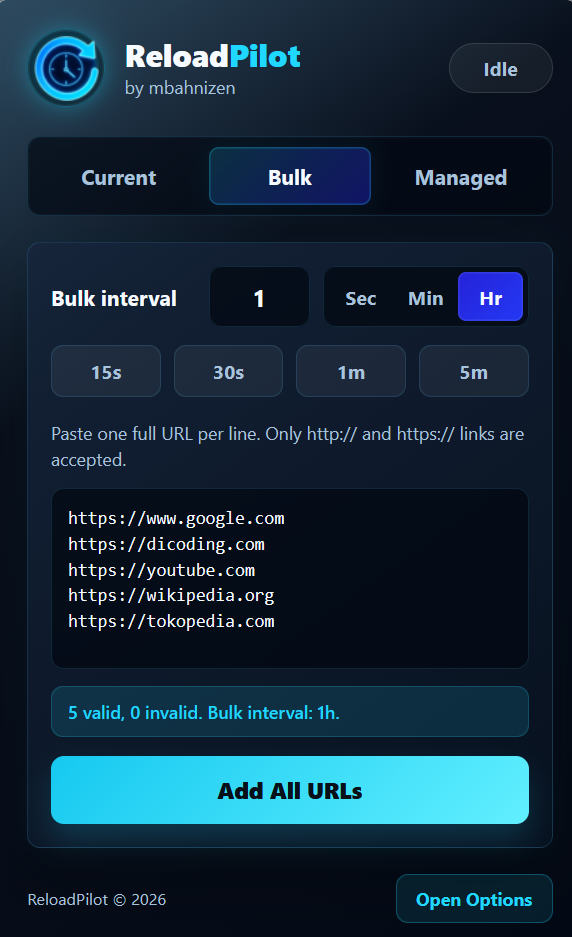
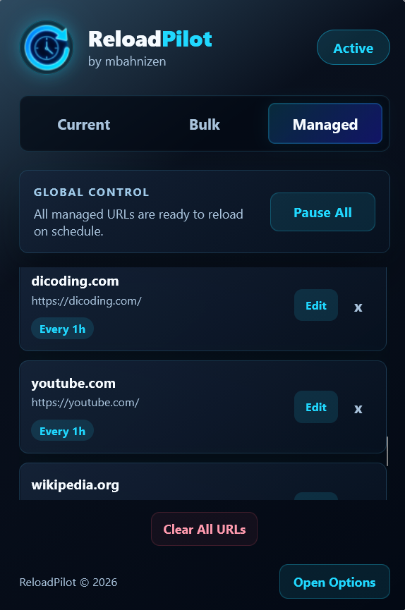
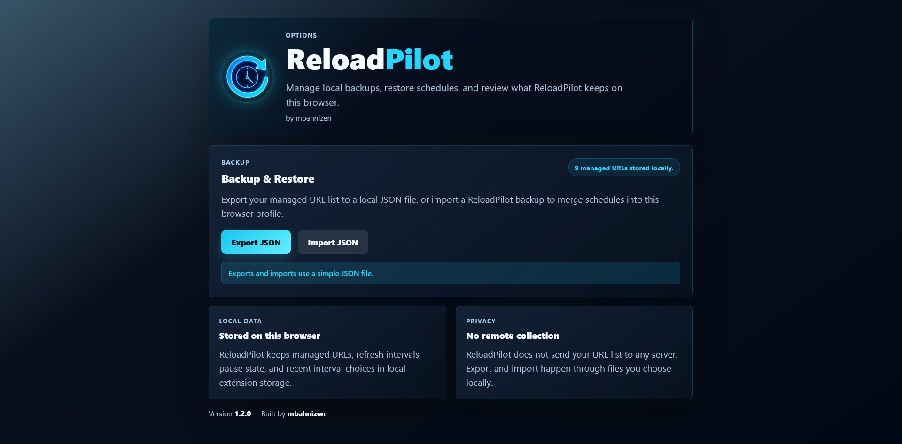
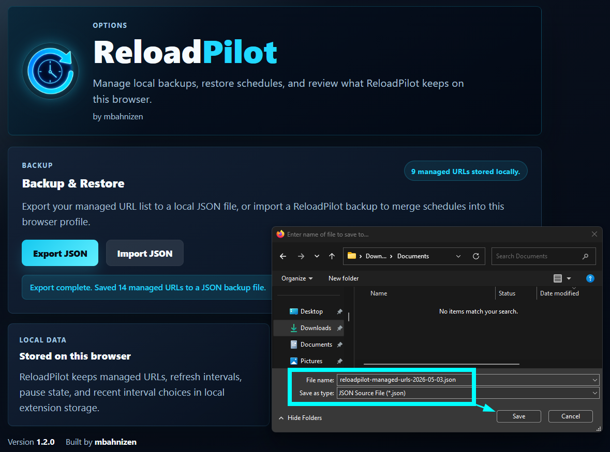

<p align="center">
  
</p>

# ReloadPilot

[](CHANGELOG.md)
[](LICENSE)
[](https://addons.mozilla.org/en-US/firefox/)

Precision tab reloading for focused workflows.

ReloadPilot is a lightweight Firefox extension for scheduling page reloads per URL. It is built for dashboards, queues, monitoring pages, and other tabs that need to stay fresh without making you babysit the refresh button.

## Highlights

- Set reload intervals for the current tab in seconds, minutes, or hours.
- Add multiple full URLs at once from the Bulk tab.
- Review, edit, pause, resume, or remove managed reload schedules.
- See countdown status in the popup and toolbar badge before a reload happens.
- Export and import managed URLs as a local JSON backup.
- Stores settings locally in your browser profile.

## Screenshots

### Current Tab

<p>
  
  
</p>

### Bulk Add & Managed URLs

<p>
  
  
</p>

### Backup & Restore

<p>
  
  <br><br>
  
</p>

## How It Works

ReloadPilot stores managed URLs and intervals in `browser.storage.local`. When a matching tab finishes loading, the background script schedules a page-native `location.reload()` for that tab and updates badge/countdown state.

The extension does not use analytics, remote scripts, or external services.

## Privacy

ReloadPilot does not collect or transmit your URL list.

Your managed URLs, intervals, pause state, and recent interval choices stay in local extension storage. Export and import actions use JSON files selected or saved by you.

## Permissions

ReloadPilot requests:

- `storage`: save managed URLs, intervals, pause state, and recent settings locally.
- `tabs`: read the active tab URL and find tabs that match managed URLs.
- `scripting`: schedule and clear reload timers in matching tabs.
- `*://*/*`: allow reload schedules for user-selected HTTP and HTTPS pages.

## Install for Development

1. Open Firefox.
2. Go to `about:debugging#/runtime/this-firefox`.
3. Click **Load Temporary Add-on**.
4. Select `manifest.json` from this repository.
5. Pin ReloadPilot to the toolbar.

After editing files, use **Reload** from the temporary extension entry.

## Build

This project uses Mozilla's `web-ext` tooling:

```bash
npx web-ext lint --self-hosted
npx web-ext build --overwrite-dest
```

Build output is written to `web-ext-artifacts/`.

## Project Structure

```text
background/       Background scheduling logic
popup/            Toolbar popup UI
options/          Backup, restore, and local data info page
icons/            Runtime extension icons
docs/images/      GitHub README screenshots and banner
specs/            Planning and manual test notes
```

## Manual Testing

See `specs/manual_test_checklist.md` for the pre-release checklist.

## Contributing

Please see [CONTRIBUTING.md](CONTRIBUTING.md) for details on how to set up the project, run tests, and submit pull requests.

## License

This project is licensed under the [MIT License](LICENSE).

---

Built by mbahnizen.
